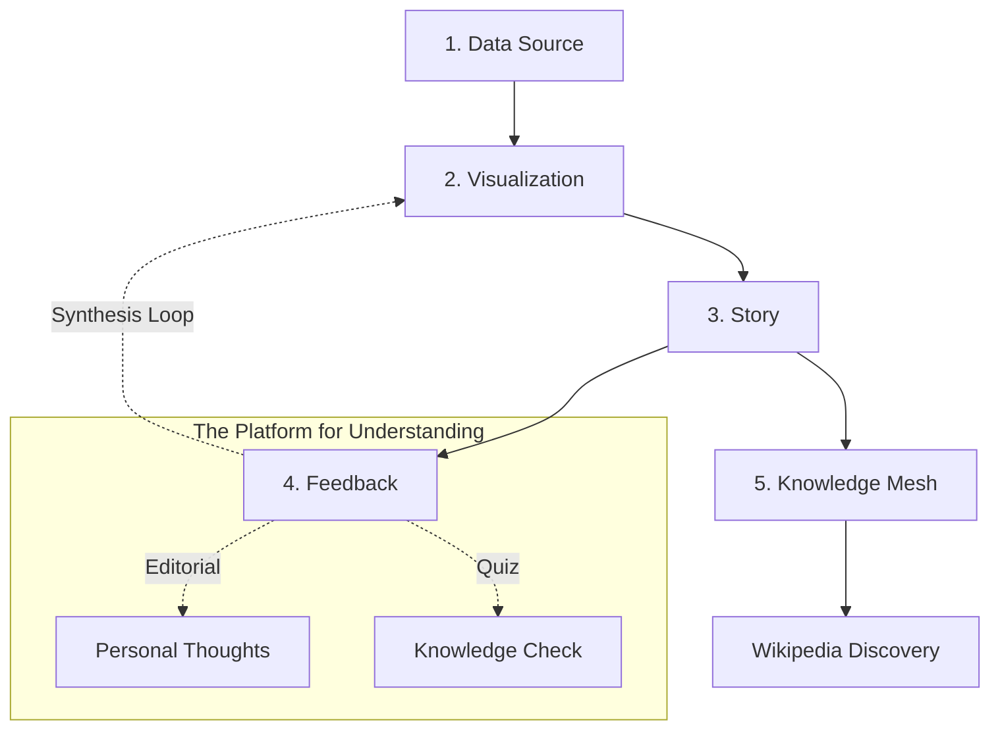
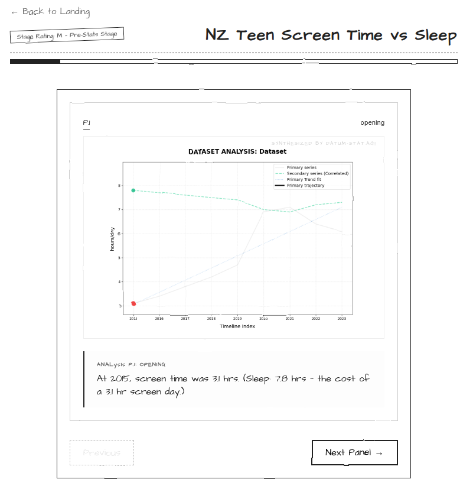

# 📓 Datum Ex Machina: The Pacific Research Archive

> **"Regional Evidence, Narrated as Code."**

**Datum Ex Machina** is a specialized digital archive for **New Zealand and Pacific Island** statistical narratives. It transforms raw regional datasets into high-fidelity technical comics. Following the **"Everything as Code"** principle, every story is a self-contained, portable, and Jupyter-exportable Python asset designed for collective understanding.

## 🏗️ Core Architecture

**Datum Ex Machina** follows a strictly defined four-stage pipeline to transform raw evidence into human understanding:



### 📖 Architecture in Action: "NZ Teen Screen Time vs Sleep"



1.  **Data Source**: Unified dataset management (Digital Habit Data).
2.  **Visualization**: Statistical analysis and high-fidelity diagram generation (Shown in the center panel).
3.  **Story**: Narrative archetypes and persona-driven dialogue (The "Opening" beat shown below the chart).
4.  **Feedback**: A dual-path stage where users verify their understanding (Quiz) and contribute their own "Editorial" thoughts (Triggered after the "Next Panel" sequence).

## ⚙️ Technical Infrastructure

The application is built for simplicity and performance as a **Single-Process App**:
- **Unified Server**: A FastAPI backend serves both the analytical API and the React frontend static files.
- **Port 8000**: Access everything (UI and API) through a single entry point.
- **Micro-Container**: Optimized for Google Cloud Run with a minimal memory footprint.

## 🧬 Story-as-Code Engine

The platform treats every narrative as a standalone piece of software. Each "Story" in the `backend/stories/` archive is a single, self-contained Python module:

- **Everything as Code**: Data analysis, narrative beats, and regional metadata (Region, Tier, Dependencies) are all defined within the `story.py` source file.
- **Jupyter Portability**: All story scripts are authored with standard `# %%` cell markers, making them instantly exportable and runnable as **Jupyter Notebooks**.
- **Regional Custodianship**: We specialize in the **Aotearoa and Pasifika** context, arching everything from local housing trends to regional climate observations.

### Featured Archival Units
- **2024 Highlanders: Battle Lines**: A bivariate "Attacking Power vs. Defensive Pressure" analysis of the Super Rugby season.
- **NZ Screen Time vs Sleep**: A correlation study of digital habits and rest trade-offs, involving **COVID-19** pandemic context.

### Contributing to the Archive
To add a new regional unit, simply push a self-contained folder to `backend/stories/`. Guided by the **Pacific Research Desk**, the system will automatically discover and register your contribution.

## 🚀 Quick Start (Docker)

The project is fully containerized for both local development and cloud deployment.

### 1. Launch the App
From the project root:
```bash
docker compose up --build
```

### 2. Access the Stage
- **Unified Stage**: [http://localhost:8000](http://localhost:8000)
- **API Health**: [http://localhost:8000/api](http://localhost:8000/api)

## 📊 Feature Highlights
- **Knowledge Discovery Mode**: An interactive "Discovery" layer that reveals Wikipedia context for critical data points (e.g., Rogernomics, Paris Agreement).
- **Statistical Personas**: Concept-driven characters (The High Performance Coach, The Match Official) narrate the data using real-world terminology.
- **PyTorch Diagrams**: High-fidelity charts with OLS Regression lines rendered directly from the analytical core.
- **Verified Quizzes**: Every story ends with a mental-model check to ensure the data's "lesson" was understood.

## ✍️ Developer Guide: Linking Wikipedia

To preserve the archive's scholarly focus, we strictly limit Knowledge Relations to **Wikipedia**.

### 1. Identify "Era" Data Points
Find the canonical year or match where a major shift occurs (e.g., the 2008 GFC impact on employment).

### 2. Implement the Mesh
In your `story.py`, override `get_knowledge_relations()`:

```python
def get_knowledge_relations(self) -> List[Dict]:
    return [
        {
            "id": "gfc_impact",
            "label": "Great Recession",
            "x_target": 2008, 
            "type": "Event",
            "description": "The 2008 GFC triggered a multi-year surge in jobless trends.",
            "wikipedia": "https://en.wikipedia.org/wiki/Great_Recession"
        }
    ]
```

### 3. Verification
Run the registry audit script to ensure your mesh is correctly serialized:
```bash
PYTHONPATH=./backend python3 -c "from stories.registry import get_story; print(get_story('your-id').get_knowledge_relations())"
```

## 🛠️ Technical Stack
- **Frontend**: React, Vite, CSS Modules.
- **Backend**: FastAPI, PyTorch (OLS Regression), Matplotlib, Pandas.
- **Infrastructure**: Single-container Docker, optimized for Google Cloud Run.
- **Deployment**: `deploy-cloud.sh` for one-click GCP deployment.
