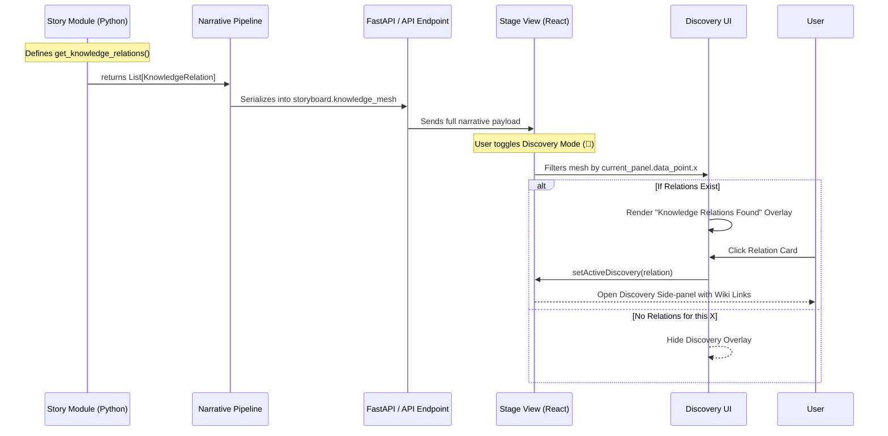

# Low-Level Design: Knowledge Discovery Framework

The **Knowledge Discovery Framework** is an architectural extension to the Datum Ex Machina narrative engine. It allows statistical data points to be systematically linked to external Wikipedia contexts through an interactive "Discovery" layer.

## 1. Core Architecture

The framework follows a "Stat-to-Knowledge" mapping pattern, where each story module is responsible for defining its own intellectual context.

### Sequence Diagram: Knowledge Flow



## 2. Data Models

### KnowledgeRelation (Python)
```python
{
    "id": str,               # Unique relation ID
    "label": str,            # Short title (e.g. "Ground Glass")
    "x_target": float,       # The year/point this relation appears
    "type": "Concept" | "Event", 
    "description": str,      # Narrated context
    "wikipedia": str         # Link to Wikipedia article only
}
```

## 3. Implementation Logic

### Backend: Story Integration
Each story overrides the `get_knowledge_relations` method. The narrative pipeline (`map_to_storyboard`) ensures this list is included in the global static metadata for the story session.

### Frontend: Conditional Rendering
The `Stage.jsx` component manages the discovery state:
1.  **Toggle State:** `isDiscoveryMode` (boolean).
2.  **Point Filtering:** Uses `.some(rel => rel.x_target === currentPanel.x)` to dynamically show/hide the "Relations Found" overlay.
3.  **Side-Panel:** Reuses the concept-focus overlay but with a distinct "Gold" thematic style to differentiate it from the standard glossary.

## 4. Design Standard
- **Source of Truth:** Strictly Wikipedia links only.
- **Visual Aesthetic:** Discovery cards and side-panels use a high-contrast gold/amber theme (`#fbbf24`) to denote "hidden knowledge."
- **Non-Intrusive:** The discovery layer is opt-in and does not interfere with the primary statistical narrative.
