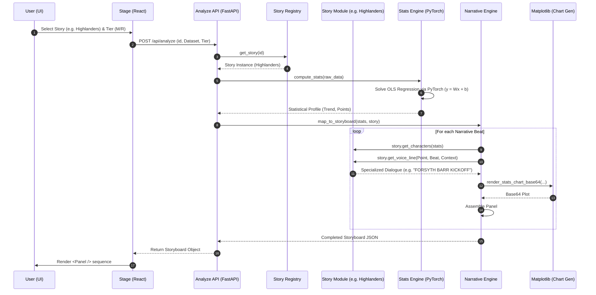

# Datum Ex Machina: Rendering Pipeline

This document describes the low-level sequence of operations required to transform a raw statistical dataset into a narrative-driven comic storyboard.

## Comic Generation Sequence

## Key Components

### 1. Statistical Processing (`backend/pipeline/stats.py`)
Calculates the central tendency and identifies the **Narrative Archetype** of each point (e.g., "Outlier," "Peak," "Mean"). We use PyTorch for the linear regression to ensure the trend lines are mathematically precise.

### 2. Narrative Beat Mapping (`backend/pipeline/narrative.py`)
Determines the "rhythm" of the comic. It decides when to show the "Opening," where the "Turning Point" (greatest change) occurs, and how to conclude the story (Cliffhanger vs. Plateau).

### 3. Character Voice Bank (`backend/pipeline/voices.py`)
Injects personality. Each data archeype (The Mean, Standard Deviation, The Outlier) has a distinct voice. This layer also handles **Correlation Logic** (e.g., relating Screen Time to COVID-19 lockdowns).

### 4. Dynamic Visualization (`backend/pipeline/stats.py`)
Charts are generated on-the-fly as Base64 images. This ensures the hand-drawn xkcd aesthetic remains consistent between the data visuals and the stick-figure characters.
