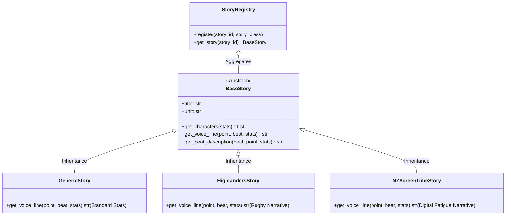
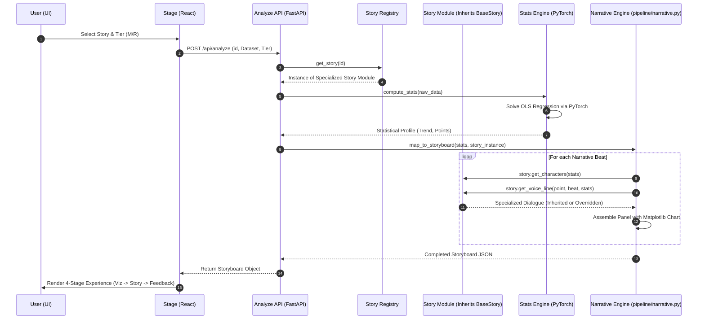

# Datum Ex Machina: Rendering Pipeline

This document describes the low-level sequence of operations required to transform a raw statistical dataset into a narrative-driven comic storyboard using our **Modular Inheritance Architecture**.

## 🧬 Class Inheritance Model

Each dataset in **Datum Ex Machina** is governed by a specialized class that inherits from a common base, ensuring consistent narrative logic while allowing for unique "voices."

## 🏗️ Comic Generation Sequence

## 🛠️ Key Components

### 1. Statistical Processing (`backend/pipeline/stats.py`)
Calculates the central tendency and identifies the **Narrative Archetype** of each point (e.g., "Outlier," "Peak," "Mean"). We use PyTorch for linear regression to ensure mathematical precision.

### 2. The Base Story Template (`backend/stories/base.py`)
The **Abstract Base Class (`BaseStory`)** defines the required interface for all datasets. It handles the shared boilerplate, while child classes (e.g., `HighlandersStory`) only need to override the `get_voice_line` or `get_characters` methods to inject their unique personality.

### 3. Narrative Beat Mapping (`backend/pipeline/narrative.py`)
Determines the "rhythm" of the comic. It decides when to show the "Opening," where the "Turning Point" occurs, and how to conclude the story (Cliffhanger vs. Plateau). It orchestrates the handover between calculations and the Story Module.

### 4. Stage 4: Feedback (Personal Feedback Desk)
Once the narrative sequence completes, the pipeline transitions to the **Editorial Stage**. Here, the user's personal synthesis is captured and stored in the database, acting as the final feedback loop for the "Platform for Understanding."
