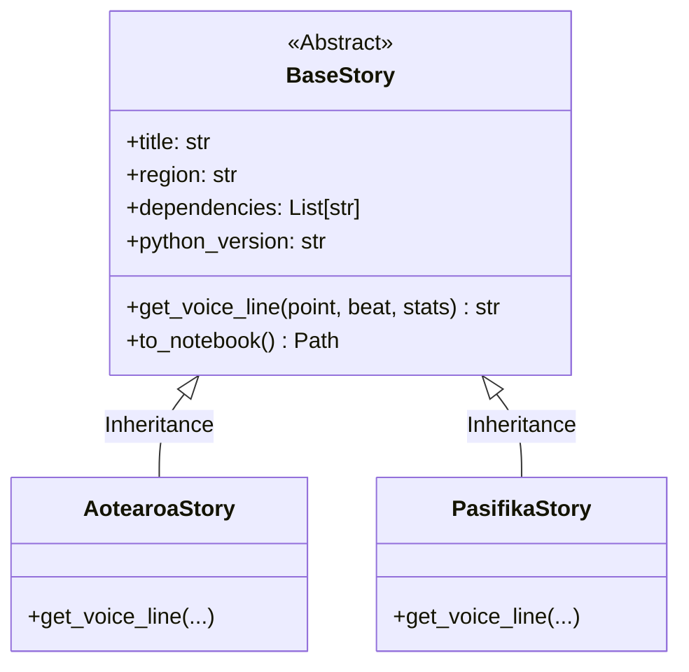
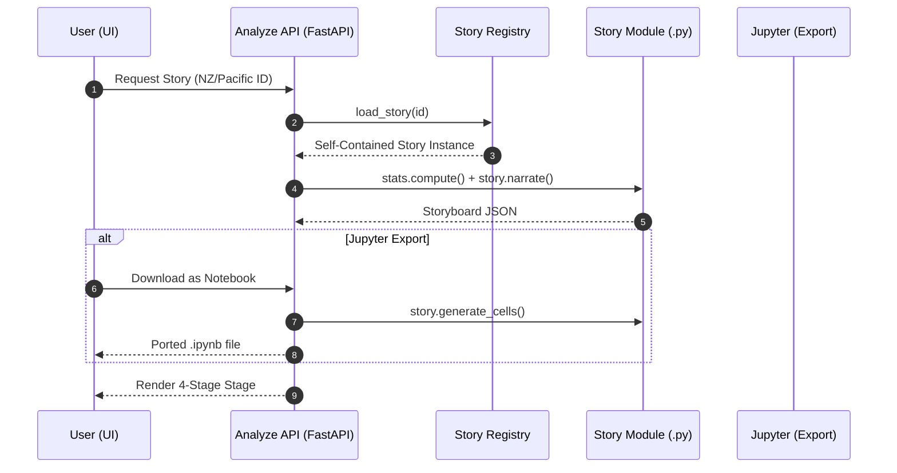

# Datum Ex Machina: Rendering Pipeline

This document describes the sequence required to transform regional datasets into narrative-driven comics using our **"Story-as-Code"** architecture.

## 🧬 Story-as-Code Architecture

Every story in the Pacific Archive is a single, self-contained Python module. This ensures maximum portability and transparency.

## 🏗️ Generation & Export Sequence

## 🛠️ Key Components

### 1. The Research Desk Discovery
The system uses the `backend/stories/` folder as a file-based database. To register a new Pacific narrative unit, an archivist simply pushes a self-contained `story.py` file to the repository.

### 2. Standalone Portability
Each story includes its own **dependency manifest** and **Python version** requirements. This follows the "Everything as Code" principle, ensuring that the logic used to analyze the dataset is as transparent and portable as the data itself.

### 3. Jupyter Integration (`# %%` markers)
Stories are authored with `# %%` cell markers. This allows the core logic to be run instantly in any standard notebook environment, bridging the gap between a web application and a research tool.

### 4. Stage 4: Synthesis Loop
The pipeline concludes with the **Synthesis Stage**, where user editorials are collected and fed back into the regional context, enriching the archive with collective community thought.
